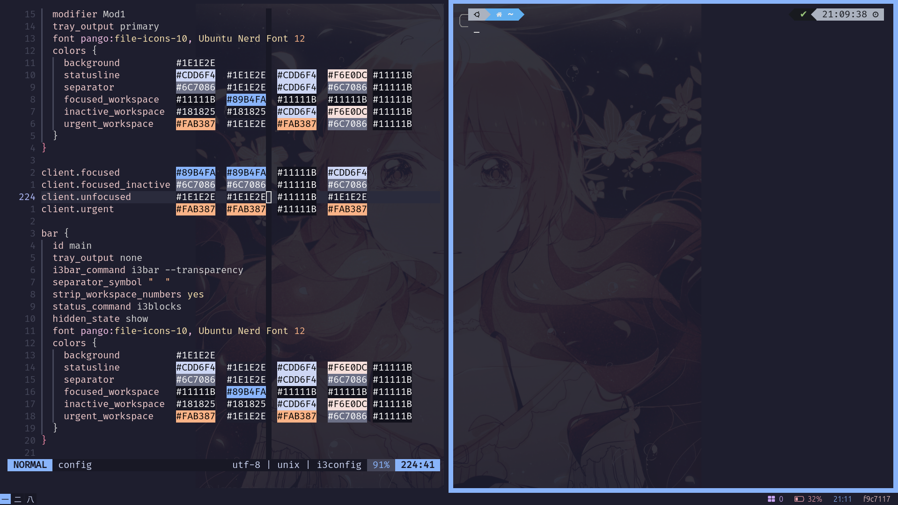

# Dotfiles & Configurations

> These are my `dotfiles`. There are many like them, but these ones are mine.
>
> My `dotfiles` are my best friends. They are my life. I must master them as I
> master my life.
>
> My `dotfiles`, without me, are useless. Without my `dotfiles`, I am useless.



## About

- For colour schemes I'm switching between [pinkmare](https://github.com/Matsuuu/pinkmare), [Rose Pine](https://github.com/rose-pine/neovim), or [Catppuccin](https://github.com/catppuccin/emacs) at the moment
- I'm using [Comic Shanns](https://github.com/shannpersand/comic-shanns) (patched) and recently switched from [Fira Code](https://github.com/tonsky/FiraCode) everything
- I'm on Ubuntu most of the time
- I'm primarily using Neovim, very rarely Emacs

## Deploy

I use a [bare git repo](https://www.atlassian.com/git/tutorials/dotfiles) to
manage these files, as I think it's simply and *fairly* system agnostic:

```sh
curl -Lks https://julianorchard.co.uk/bin/install.sh | /bin/bash
```

## Featured Scripts

The list below is generated by `.bin/readme-details.py`!

### cmdrc.bat <sup>[file](.bin/cmdrc.bat)</sup>

This is a method of having a custom prompt in CMD. It's opened by AutoHotkey (see ahk/general.ahk for more information).

### config.bat <sup>[file](.bin/config.bat)</sup>

The command used to manage the bare repo: ```cmd git --git-dir=%HOME%/.dotfiles/ --work-tree=%HOME% ``` ... for use in the Windows CMD.

### drives.bat <sup>[file](.bin/drives.bat)</sup>

Add shortcuts to available drives.

### font-install-arch <sup>[file](.bin/font-install-arch)</sup>

Shell script to quickly install fonts, from online, on my ThinkPad x220. But obviously *may* work on many nix systems.

### git-commit-date-fix.sh <sup>[file](.bin/git-commit-date-fix.sh)</sup>

Use this script to fix commit dates on recent git commits. You can specify looking at more historic commits by inputting an integer as an argument, for example, this will show 20 of the most recent commits for you to select from (default is 5): ```sh $ ./git-commit-date-fix.sh 20 ``` The other thing you can do is include a string argument. This will be used to change the git command used (for example, my `config` custom bash function).

### install.sh <sup>[file](.bin/install.sh)</sup>

Install the dotfiles. Edited from the [original source](https://bitbucket.org/durdn/cfg/src/master/.bin/install.sh).

### layout <sup>[file](.bin/layout)</sup>

Set default screen layouts using xrandr and resetting the wallpaper, basically.

### ll.bat <sup>[file](.bin/ll.bat)</sup>

`dir` isn't it my muscle memory at all.

### readme-details.py <sup>[file](.bin/readme-details.py)</sup>

This is the script that generates what you might be reading *now*! It scrapes the `.bin/` folder and gets the text under the *'description'* heading (above). It's pretty simple, but nice to give an overview of what files are in this repo. Often run with a GitHub Action and the `--action` flag. See [.github/...](.github/workflows/main.yaml) for more!

### refreshprompt.bat <sup>[file](.bin/refreshprompt.bat)</sup>

The main use case for this being whenever we change Git profiles. This isn't something I do as often as I used to.

### shortcuts.bat <sup>[file](.bin/shortcuts.bat)</sup>

Use this script to create a shortcut to the current folder you're in. I've found this especially useful for CMD navigation.

## Contributing

These are my personal dotfiles. If you want to fork this repo and use them,
that's absolutely fine, but (unless you find a breaking change) I probably
won't be accepting PRs.

## License

Everything here, unless otherwise stated, is under the MIT License. See
[License](/LICENSE) for more information.

## Credits

These credits don't cover every resource that has helped me on my way to these
configurations, but they're hopefully giving credit to some of the biggest
influences on them...

#### Vim/Neovim

- My Neovim config ~~is~~ was initially based on [kickstart.nvim](https://github.com/nvim-lua/kickstart.nvim) (I made the switch when the [Packer](https://github.com/wbthomason/packer.nvim) package manager became unmaintained)
- [Tim Pope](https://github.com/tpope), for obvious reasons
- [ThePrimeagen](https://github.com/ThePrimeagen) for getting me out of Emacs and into Neovim
- Random bits from the dotfiles of [Daniel Hahler](https://github.com/blueyed)

#### Emacs

- A more minimal Emacs configuration by [Ronmi](https://github.com/Ronmi/emacs) is the biggest inspiration for my most recent Emacs version
- [Daviwil's Emacs From Scratch series](https://github.com/daviwil/emacs-from-scratch) (which is what got me into Emacs in the first place!)
- [Tecosaur's config](https://tecosaur.github.io/emacs-config/config.html), a beautiful literate configuration
- [RedGuardToo's](https://github.com/redguardtoo/emacs.d) dotfiles, plus his [Mastering Emacs in One Year](https://github.com/redguardtoo/mastering-emacs-in-one-year-guide) Guide
- [Protesilaos' config](https://protesilaos.com/emacs/dotemacs) and his [YouTube videos](https://www.youtube.com/@protesilaos)

#### Windows

- [Chocolatey](https://chocolatey.org/) for their very useful

[`refresh.cmd`](https://github.com/chocolatey/choco/blob/develop/src/chocolatey.resources/redirects/RefreshEnv.cmd)
